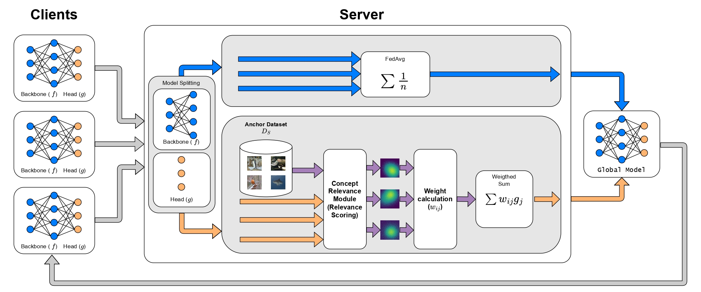

# FedCReW: Federated Concept Relevance Weigthing

FedCReW is a novel federated learning approach that uses Concept Relevance Propagation (CRP) to intelligently weight client contributions during aggregation. Unlike traditional federated averaging, FedCReW identifies which clients have learned the most relevant features for each class by analyzing concept relevance heatmaps.



## How It Works

FedCReW operates in three key phases during each federation round:

### 1. Client Training
- **Clients** train their local models (composed of a shared Backbone $f$ and a classification Head $g$) on their private data
- After training, clients send their model updates to the server

### 2. Feature Relevance Analysis
- The server uses an **anchor dataset** ($D_S$) - a small balanced set of samples representing each class
- Each client's model is evaluated on the anchor dataset using the **Concept Relevance Module** (CRP)
- This generates relevance heatmaps showing which features each client uses to classify each sample
- Clients that use relevant, causal features receive higher weights

### 3. Weighted Aggregation
- **Backbone layers** are aggregated using standard FedAvg
- **Head layers** are aggregated using weighted averages based on the relevance scores ($w_{ij}$)
- The formula $\sum w_{ij}g_j$ combines head weights, where $w_{ij}$ represents how well client $j$ classifies class $i$
- This ensures the global model prioritizes clients with better feature understanding

## Repository Structure

```
├── main.py                  # Main entry point and training loop
├── config.py                # Experiment configuration and argument parsing
├── datasets.py              # Dataset loading and configuration
├── models.py                # Model architectures
├── utils/
│   ├── training.py          # Training and evaluation functions
│   ├── crp_utils.py         # CRP attribution and heatmap generation
│   ├── data_utils.py        # Data selection utilities
│   ├── logging_utils.py     # TensorBoard and Weights & Biases logging
│   ├── flex_boilerplate.py  # FLEX framework boilerplate
│   ├── fedprox.py           # FedProx regularization
│   └── fednova.py           # FedNova support
└── pyproject.toml           # Project dependencies
```

## Installation

This project uses [uv](https://github.com/astral-sh/uv) for dependency management and Python environment handling. For installation please refer to [the official installation page](https://docs.astral.sh/uv/getting-started/installation/).


### 1. Clone and Setup

```bash
git clone <repository-url>
uv sync
```

This will create a virtual environment and install all dependencies specified in `pyproject.toml`.

### 2. Activate Environment

```bash
source .venv/bin/activate  # Linux/Mac
# or
.venv\Scripts\activate     # Windows
```

or run everything by prexifing `uv run` to the following commands.
## Quick Start

### Basic Usage

Run FedCReW on CIFAR-10, with 25 clients per round and 10 epochs of local training per round:

```bash
python main.py --dataset cifar_10 --fedcrew --rounds 100 --clients 25 --epochs 10
```

### Command Line Arguments

| Argument | Description | Default |
|----------|-------------|---------|
| `--dataset` | Dataset to use: `cifar_10`, `cifar_10_non_iid`, `celeba`, `celeba_a`, `celeba_m`, `mnist_non_iid` | `cifar_10` |
| `--clients` | Number of clients per round | 100 |
| `--fedcrew` | Enable FedCReW weighted aggregation | False |
| `--rounds` | Number of federation rounds | 100 |
| `--epochs` | Number of local epochs per client | 10 |
| `--batchsize` | Batch size for training | 64 |
| `--samples` | Number of samples per class for CRP anchor dataset | 2 |
| `--alpha` | Threshold for counting sample as correct in CRP | 0.0 |
| `--fedprox` | FedProx regularization factor (0.0 to disable) | 0.0 |
| `--fednova` | Enable FedNova aggregation | False |
| `--l1` | L1 regularization factor | 0.0 |
| `--l2` | L2 regularization factor (weight decay) | 0.0 |
| `--l2_fc` | L2 regularization for FC layer only | 0.0 |
| `--no_log` | Disable logging | False |
| `--lognum` | Log directory suffix number | 0 |
| `--seed` | Set a seed for deterministic experimentation | None |

### Examples

**FedCReW on CelebA (2-class classification):**
```bash
python main.py --dataset celeba --fedcrew --samples 5 --rounds 50
```

**Standard FedAvg baseline:**
```bash
python main.py --dataset cifar_10 --rounds 100
```

**FedProx:**
```bash
python main.py --dataset cifar_10_non_iid --fedprox 0.01 --rounds 100
```

**Non-IID CIFAR-10 with FedCReW:**
```bash
python main.py --dataset cifar_10_non_iid --fedcrew --samples 3 --rounds 100
```

## Logging

By default, experiments log to:
- **TensorBoard**: `runs/{dataset}/` directory
- **Weights & Biases**: Project "crp_aggregation"

Use `--no_log` to disable logging.

View TensorBoard logs:
```bash
tensorboard --logdir runs/cifar_10/
```

## Datasets

The repository supports several federated datasets:

- **CIFAR-10**: 10-class image classification (IID and non-IID)
- **CelebA**: Binary classification tasks (attractive, smiling, male)
- **EMNIST**: Handwritten character recognition (non-IID)

Datasets are automatically downloaded on first use and cached locally.

## Key Features

- **Modular Design**: Clean separation of training, CRP analysis, and logging
- **Multiple Aggregation Methods**: Support for FedAvg, FedProx, FedNova, and FedCReW
- **Flexible Configuration**: All hyperparameters configurable via command line
- **Comprehensive Logging**: TensorBoard and W&B integration for experiment tracking
- **Type Safety**: Full type hints throughout the codebase

## Acknowledgments

This implementation is built on top of the [FLEX](https://github.com/FLEXible-FL/FLEX-framework) federated learning framework and uses [Zennit](https://github.com/chr5tphr/zennit) and [CRP](https://github.com/rachtibat/crp) for concept relevance propagation.
